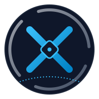
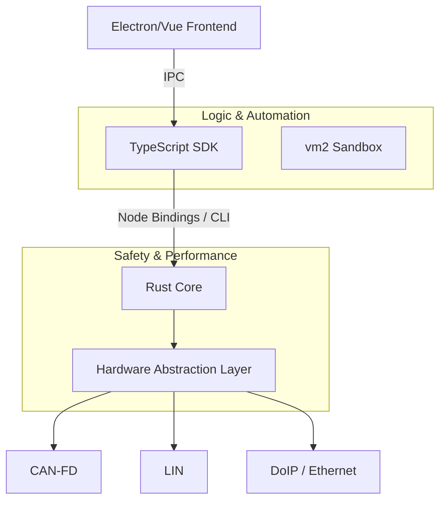

<p align="center">
  
</p>

# 🌌 AutoNexus

[](https://github.com/ismailtsdln/AutoNexus/actions)
[](https://opensource.org/licenses/MIT)
[](https://www.rust-lang.org/)
[](https://vuejs.org/)

**AutoNexus** is a next-generation, high-performance automotive communication hub and diagnostic platform. It replaces traditional, fragmented ECU testing tools with a unified, extensible architecture that bridges the gap between low-level hardware performance and high-level scripting flexibility.

---

## ✨ Features

### 🏎️ High-Performance Core (Rust)

- **Universal Hardware Abstraction**: Pluggable architecture supports PEAK, Kvaser, Vector, and Mock adapters.
- **Protocol Mastery**: Built-in support for **CAN/CAN-FD**, **LIN**, **UDS (ISO-14229)**, and **DoIP (ISO-13400)**.
- **Safety First**: Memory-safe implementation prevents common buffer overflows and race conditions in mission-critical diagnostic sessions.

### 📜 Intelligent Scripting (TypeScript SDK)

- **TypeScript First**: Full type safety and auto-completion for complex automotive sequences.
- **Secure Sandbox**: Logic execution within a secured `vm2` environment, keeping your host system safe.
- **Async Power**: Native support for asynchronous diagnostic flows and multi-node coordination.

### 📊 Professional Diagnostics UI (Electron + Vue 3)

- **Real-Time Signal Monitor**: High-frequency data visualization via Chart.js.
- **Glassmorphic Design**: Modern, premium dark-mode interface designed for engineers.
- **Session Analysis**: Integrated logging and traffic monitoring with deep-packet inspection.

---

## 🏗️ Architecture



---

## 🚀 Getting Started

### Prerequisites

- [Rust](https://rustup.rs/) (latest stable)
- [Node.js](https://nodejs.org/) (v20+)
- [npm](https://www.npmjs.com/)

### Installation

1. Clone the repository:

   ```bash
   git clone https://github.com/ismailtsdln/AutoNexus.git
   cd AutoNexus
   ```

2. Build the Rust core and CLI:

   ```bash
   cd core
   cargo build --release
   ```

3. Setup the SDK:

   ```bash
   cd ../sdk
   npm install
   ```

4. Launch the Desktop UI:

   ```bash
   cd ../ui
   npm install
   npm run dev
   ```

---

## 📖 Usage Examples

### CLI: Sending a UDS Read Request

```bash
autonexus-cli uds read --did 0xF190
```

### SDK: Automated Diagnostic Script

```typescript
import { UdsSession, MockCanAdapter } from '@autonexus/sdk';

const adapter = new MockCanAdapter();
await adapter.open();

const uds = new UdsSession(adapter);
const vin = await uds.readDataByIdentifier(0xF190);
console.log(`Vehicle VIN: ${vin}`);
```

---

## 🛡️ Security & Performance

- **Zero-Cost Abstractions**: Rust core ensures minimum latency for time-critical LIN and CAN-FD scheduling.
- **Resource Management**: Automatic cleanup of hardware handles on crash or exit.
- **Sandbox Isolation**: User-generated test scripts cannot escape the VM to access sensitive system files.

---

## 🤝 Contributing

We welcome contributions to AutoNexus! Please read our [CONTRIBUTING.md](CONTRIBUTING.md) for details on our code of conduct and the process for submitting pull requests.

## 📄 License

This project is licensed under the MIT License - see the [LICENSE](LICENSE) file for details.

---

<p align="center">
  Developed with ❤️ by the <b>AutoNexus Team</b>
</p>
